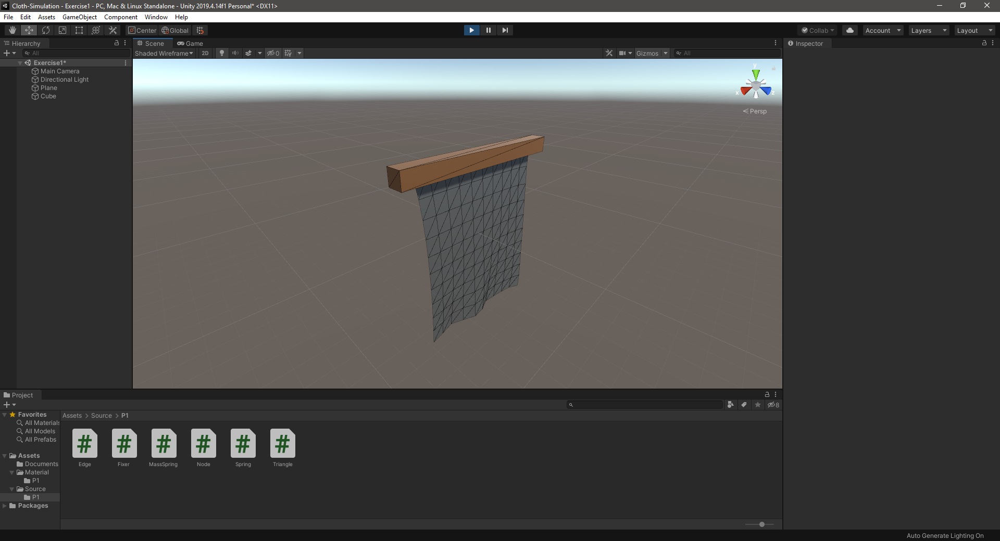
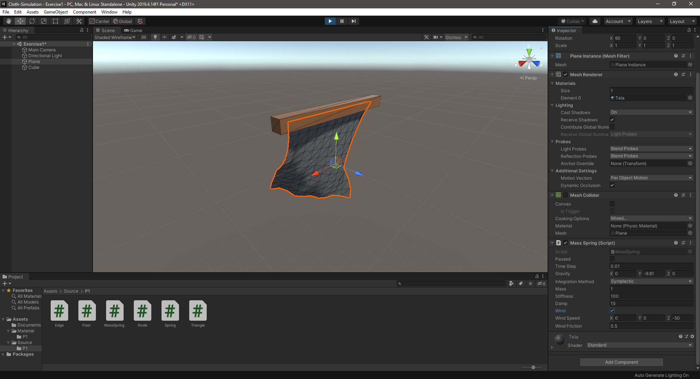

# Cloth Simulation
Programming in Unity deformable cloth (plane) simulation, modifying the mesh with the mass-spring method - Addition wind force and damping

#### Cloth without wind forces

#### Cloth with wind forces

